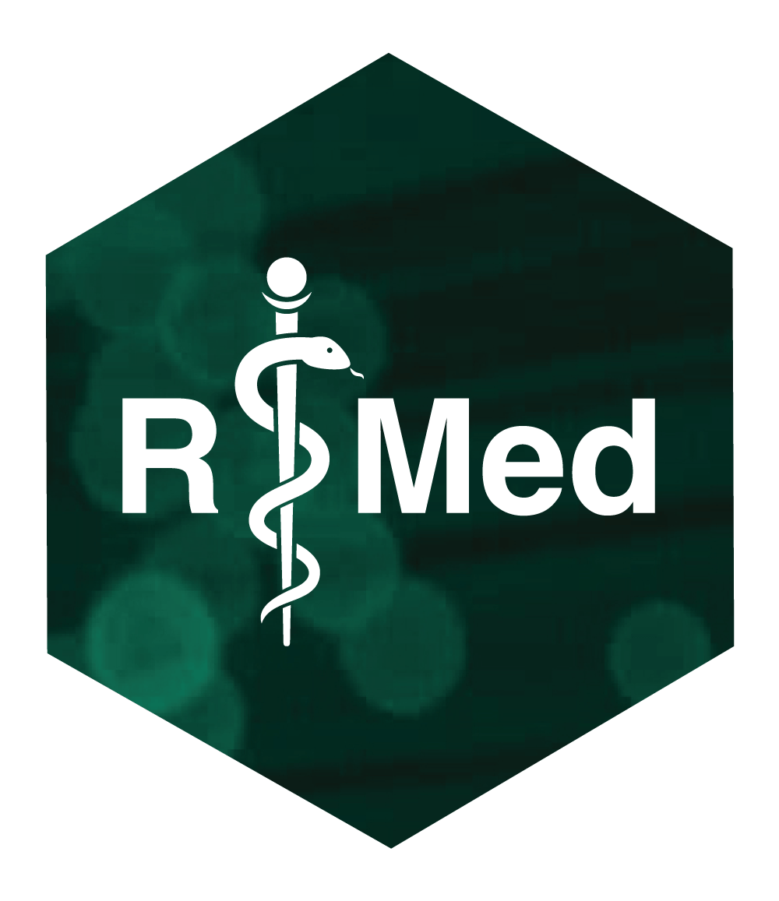

This is the repository for the Ligthinig Talk at R/Medicine 2026 about parallel computing in R.

Slides can be found in the slides folder.

# Some resources about parallel computing with **{{future}}** and **{{mirai}}**
  - Remote launch of daemons in a computer cluster (Slurm): https://mirai.r-lib.org/reference/cluster_config.html
  - Nested `future_map` calls: https://cran.r-project.org/web/packages/future/vignettes/future-3-topologies.html

