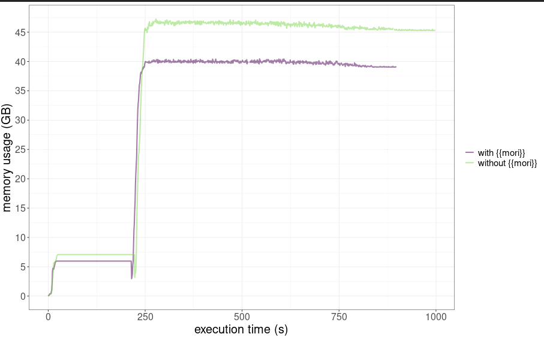

This is the repository for the Ligthinig Talk at R/Medicine 2026 about parallel computing in R.

Slides can be found **[here](https://aimundo.github.io/RMedicine2026/slides/RMedicine-2026.html#/title-slide)**.

# Some resources about parallel computing with **{{future}}** and **{{mirai}}**

 

  - Remote launch of daemons in a computer cluster (Slurm): https://mirai.r-lib.org/reference/cluster_config.html
  - Nested `future_map` calls: https://cran.r-project.org/web/packages/future/vignettes/future-3-topologies.html
  - Improving memory usage:
  -   The recently released package [{{mori}}](https://github.com/shikokuchuo/mori) reduces memory usage in parallel computing by creating an object that is shared across parallel processes!

  -   In the real implementation  of the code shown in the slides, using mori reduced memory  usage by 15%:

