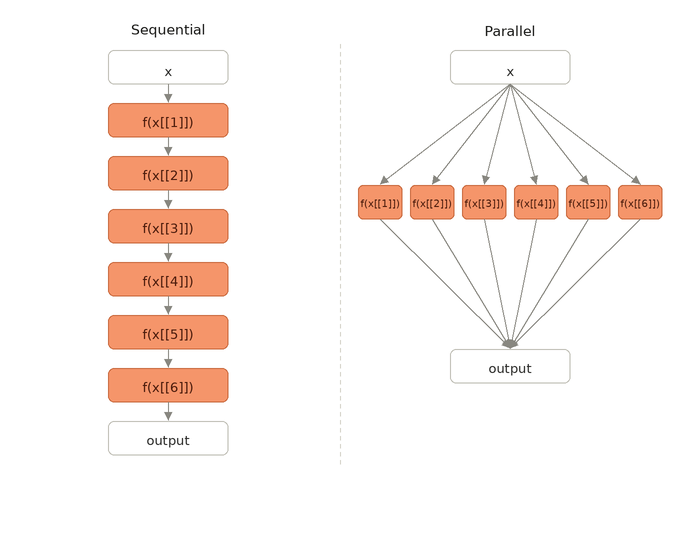

 
# Introduction

+ Big health data provides opportunities for personalized care[@galetsi2019].
+ Electronic health records (EHRs) are a form of big health data that are useful for biomedical research[@singhal2023].
  + EHRs can contain:
  + Laboratory data
  + Vital signs
  + Imaging

## Introduction

Analysing EHRs can be challenging:<br>

  + Millions of observations.<br>
  
  + Hundreds of thousands of individuals.<br>
  
  + They are accessed through secure systems<br>
  
  + Computationally, you may need a good amount of memory just to run exploratory analyses<br>
  
  
+ Running analysis in a 'traditional' manner can take a long time.

  
## An example

+ Ongoing study about vital signs in older adults.<br>


+ Data lake from the centre hospitalier de l'Université de Montréal<br>

  + From 2012 to 2024
  + 8,500,000 measurements
  + 264,000 patients
  + 5 age groups
  
+ We are studying changes in the likelihood of a clinical outcome due to body temperature.<br>
  
## An example
  
  + In age group: 55-64 years<br>
    + 2,263,642 temperature observations<br>
    + 71,831 unique patients<br>


+ We dichotomize temperature values according to a threshold. We include random effects by patient.
  
## An example 

Regression model

```{r}
#| eval: false
#| echo: true
glmer (outcome ~ test + (1 | patient_id), 
       data = data, 
       family = binomial,
       nAGQ = 0)
```

+ We obtain an estimate after running this model at 6 different thresholds.<br>

+ We could run a loop to do this...<br>

+ Or use a functional!<br>

## An example

 In a 'traditional' (sequential) manner, we would use **{{purrr}}}** :<br>


```{r}
#| eval: false
#| echo: true

mod_wrapper <- function(value, data) {

  data1 <- data %>%
    mutate(test = ifelse(temperature < {{ value }}, 0 ,1))
  
  glmer (outcome ~ test + (1 | patient_id), 
       data = data1, 
       family = binomial,
       nAGQ = 0)
  
}

values <- seq(37.0, 38.5, by = 0.3)

res <- map(values, mod_wrapper, data)


```

+ This takes... 27 minutes to complete in a shared machine with 128GB of RAM.

## The issue

+ You need to create confidence intervals for your estimates.<br>

+ Use the bootstrap<br>

+ If you do a bootstrap with n = 1,000:<br>
  
  + It would take **19** days to run this age group.<br>
 
  + It would take **95** days to run all age groups.<br>
 
+ Not even considering the resampling part.<br>


## Solution: Parallel computing 

&nbsp; &nbsp; &nbsp; &nbsp; &nbsp; &nbsp; &nbsp;{width="15%"}&nbsp; &nbsp; &nbsp; &nbsp; &nbsp; &nbsp; &nbsp; &nbsp; &nbsp; &nbsp; &nbsp; &nbsp; &nbsp; &nbsp;  {width="15%"}

+ These libraries offer an easy way to implement code in parallel<br>

+ **{{future}}** implements `future_map` in  **{{furrr}}** -> Same syntax as `map`[@future]<br>

+ **{{mirai}}** implements `daemons` (persistent background processes)[@mirai]<br>


## Going back to our example {.smaller}

 Only some minimal changes required!

```{r}
#| eval: false
#| echo: true
#| code-line-numbers: "|1|2|3|20|22|24|26"

library(mirai)
library(furrr)
library(future.mirai) 


mod_wrapper <- function(value, data) {

  data1 <- data %>%
    mutate(test = ifelse(temperature < {{ value }}, 0 ,1))
  
  glmer (outcome ~ test + (1 | patient_id), 
       data = data1, 
       family = binomial,
       nAGQ = 0)
  
}

values <- seq(37.0, 38.5, by = 0.3)

daemons(6) # run 6 background processes, 1 for each value in values (mirai)

plan(mirai_cluster) #we tell future to use the mirai backend to parallelise

res <- future_map(values, mod_wrapper, data) #future_map will use the plan we declared above, and parallelise

plan(sequential) # we close the connections (free memory)
```


## Going back to our example

+ Effectively, we are doing this:

:::: {.columns}


::: {.column width="60%"}
{.fragment}
:::

::: {.column width="40%"}

+ And how long does it take?

+ **7** minutes in 1 node of a cluster with 128GB of RAM <br>

+ As always, running code in parallel in _n_ chunks does not reduce the time by _n_.
:::

::::

## Gotchas & Conclusions

+ You most likely need a cluster to run your code in parallel. <br>

+ You can integrate parallelisation with Slurm.<br>

+ Want code to run faster? (more daemons) =  More memory and CPUs required.<br>

+ You can also run nested `future_map` calls!<br>

+ There are other libraries for parallelisation:  **{{parallel}}**, **{{foreach}}**


## References